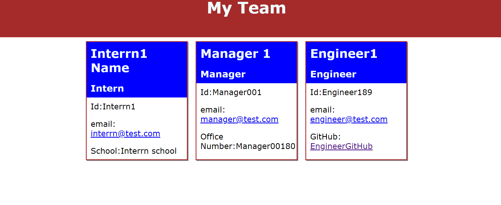

# Team Profile Generator

## Description
This is a node application to accept data from command line then create HTML based on the input

[To view a video walkthrough  app]( https://drive.google.com/file/d/1fkdbNH3y3JD7HKvWkfk7MPmFh8GI31go/view)

## installation
N/A

## usage
* To use this app the first command is node index
* Then enter manager id name email office no
* manager can enter other employee's id, name, email 
* if the employee is an engineer github user name 
* if the employee is an intern school
* based on the input html cards will create for each employee
